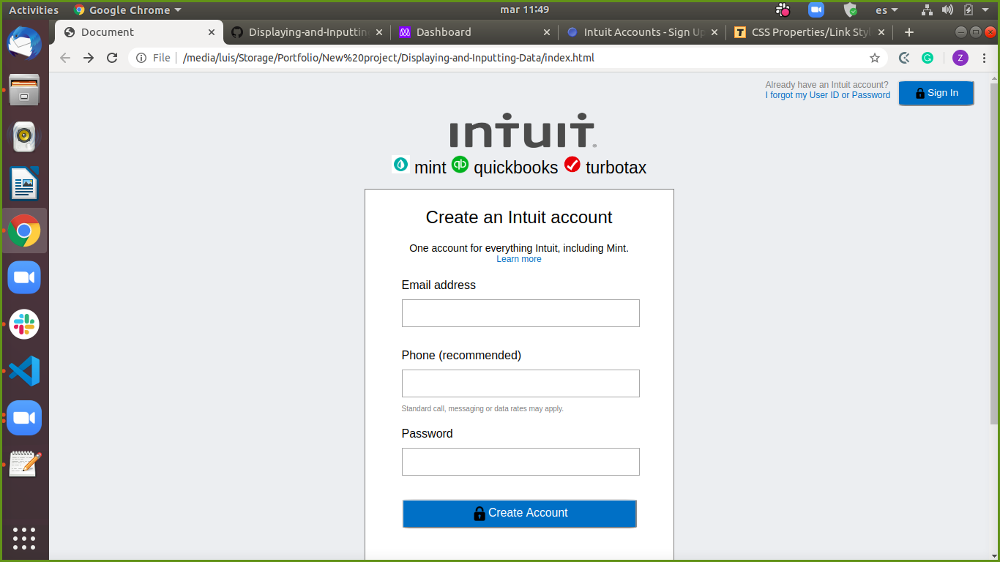

# Displaying and Inputting Data

> We are trying to clone signup page for Mint.com

Additional description about the project and its features.

## Built With

- HTML,CSS

## Live Demo

[Live Demo Link](https://livedemo.com)

## Getting Started

**This is an example of how you may give instructions on setting up your project locally.**
**Modify this file to match your project, remove sections that don't apply. For example: delete the testing section if the currect project doesn't require testing.**

To get a local copy up and running follow these simple example steps.

### Prerequisites

### Setup

### Install

### Usage

### Run tests

### Deployment

## Authors

👤 Luis Octavio Ramirez Cruz

- Github: [@LOctavio](https://github.com/LOctavio)
- Twitter: [@Octavio_ram431](https://twitter.com/Octavio_ram431)
- Linkedin: [linkedin](https://www.linkedin.com/in/luis-octavio-ramirez-cruz-714521178/)

👤 Ishan chawla 

- Github: [@ishanchawla1](https://github.com/gishanchawla1)
- Twitter: [@Ishanchawla1884](https://twitter.com/Ishanchawla1884)
- Linkedin: [linkedin](https://www.linkedin.com/in/ishan-chawla-232988b5/)

## 🤝 Contributing

Contributions, issues and feature requests are welcome!

Feel free to check the [issues page](issues/).

## Show your support

Give a ⭐️ if you like this project!

## Acknowledgments

- Hat tip to anyone whose code was used
- Inspiration
- etc

## 📝 License

This project is [MIT](lic.url) licensed.
